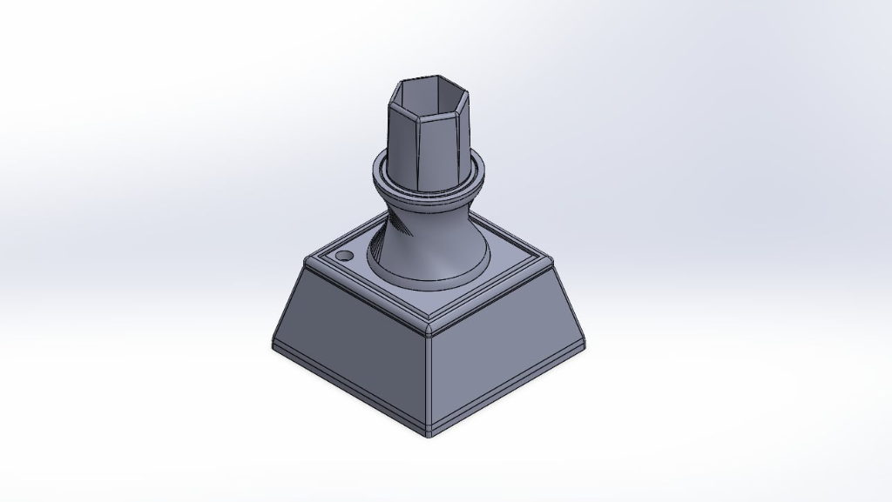
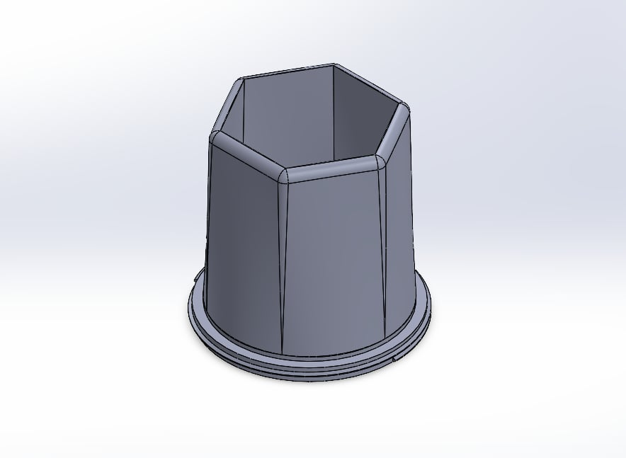
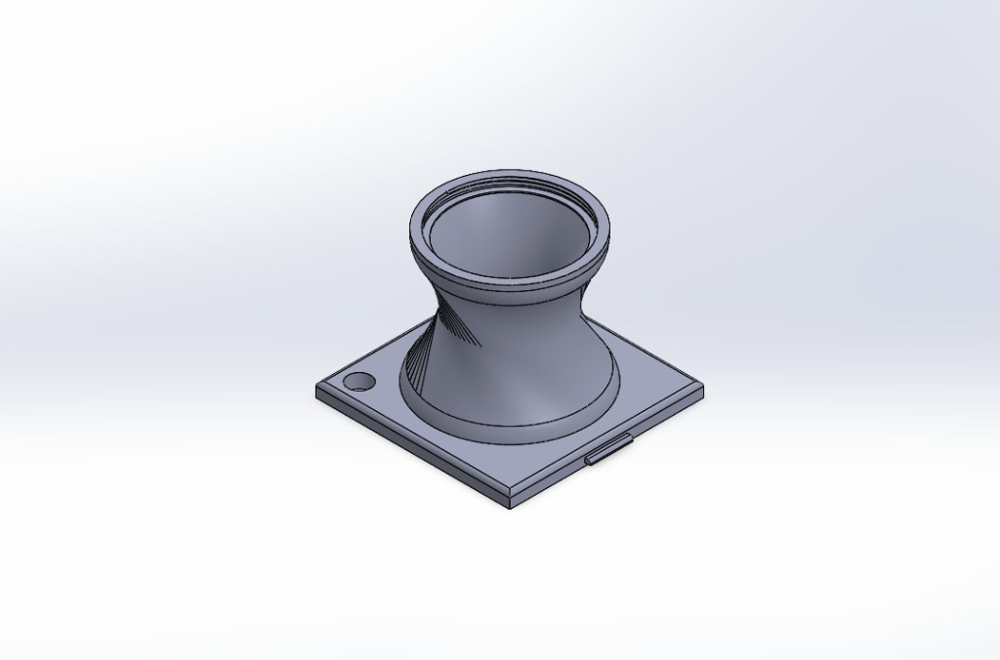
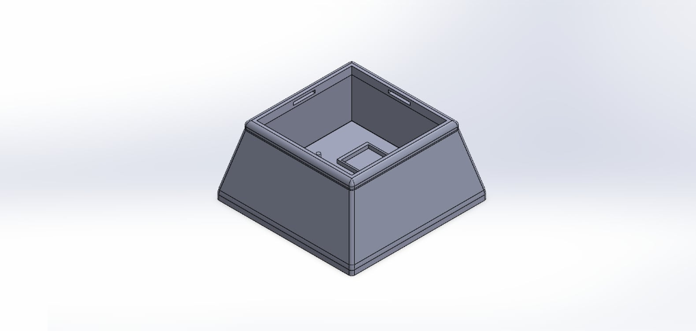
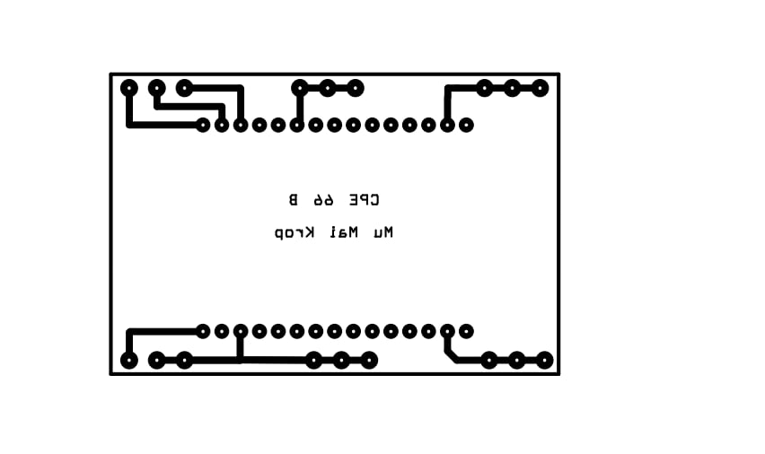

# IoT Mini Project — Smart Soil Moisture Monitoring & Auto Irrigation

โครงงานพัฒนาระบบรดน้ำต้นไม้อัจฉริยะและตรวจวัดความชื้นในดินผ่านเครือข่ายอินเทอร์เน็ต (IoT) ครบวงจร ทั้งการเขียนโปรแกรมเฟิร์มแวร์บนไมโครคอนโทรลเลอร์ **ESP8266 (NodeMCU)** เชื่อมต่อระบบคลาวด์ **Blynk IoT**, การออกแบบแผงวงจรพิมพ์เฉพาะงาน (**Custom PCB**) และการขึ้นรูปตัวเครื่องกล่องบรรจุอุปกรณ์ด้วย **3D Printing (SolidWorks CAD)**

---

## 1. การออกแบบตัวเครื่อง 3 มิติ (3D Enclosure Design)

ตัวเครื่องได้รับการออกแบบให้มีโครงสร้างแบบโมดูลาร์ (Modular Assembly) ประกอบกัน 3 ส่วนหลัก เพื่อความสะดวกในการประกอบ การเปลี่ยนดิน และการบำรุงรักษาอุปกรณ์อิเล็กทรอนิกส์

<div align="center">
  
  <p><em>ภาพรวมการประกอบตัวเครื่อง 3 มิติ (SolidWorks Assembly)</em></p>
</div>

### รายละเอียดชิ้นส่วนโมเดล 3 มิติ

| ลำดับ | ชิ้นส่วน | รายละเอียดและหน้าที่ | ไฟล์โมเดล (CAD / STL) |
|:---:|---|---|:---:|
| 1 | **กระถางด้านบน (Top Planter)** | กระถางทรงหกเหลี่ยม สำหรับบรรจุดิน ต้นไม้ขนาดเล็ก และปักโพรบวัดความชื้น | [Top_Planter.STL](hardware/stl/Top_Planter.STL)<br>[CAD Part](hardware/cad/parts/Top_Planter.SLDPRT) |
| 2 | **คอต่อส่วนกลาง (Middle Adapter)** | ตัวเชื่อมต่อทรงคอด พร้อมช่องร้อยสายไฟเซ็นเซอร์และสลักยึดล็อก Snap-fit | [Middle_Adapter_1.STL](hardware/stl/Middle_Adapter_1.STL)<br>[CAD Part](hardware/cad/parts/Middle 1.SLDPRT) |
| 3 | **กล่องฐานล่าง (Base Enclosure)** | ฐานทรงสี่เหลี่ยมคางหมู มีช่องล็อกแผงวงจร PCB, บอร์ด ESP8266 และรีเลย์ | [Base_Enclosure.STL](hardware/stl/Base_Enclosure.STL)<br>[CAD Part](hardware/cad/parts/Base1.SLDPRT) |

<div align="center">
  <table>
    <tr>
      <td align="center" width="33%">
        <br>
        <b>1. กระถางส่วนบน (Top Planter)</b>
      </td>
      <td align="center" width="33%">
        <br>
        <b>2. คอต่อส่วนกลาง (Middle Adapter)</b>
      </td>
      <td align="center" width="33%">
        <br>
        <b>3. กล่องฐานล่าง (Base Enclosure)</b>
      </td>
    </tr>
  </table>
</div>

- โมเดลชุดประกอบรวมฉบับเต็ม: [Assem1.SLDASM](hardware/cad/assembly/Assem1.SLDASM)

---

## 2. แผงวงจรพิมพ์ (Custom PCB Design)

แผงวงจรพิมพ์แบบหน้าเดียว (Single-Sided Copper PCB) ออกแบบมาสำหรับติดตั้งและเชื่อมต่อโมดูลหลักเข้าด้วยกันอย่างกะทัดรัด ลดความซับซ้อนของการเดินสายไฟภายในกล่องอุปกรณ์

<div align="center">
  
  <p><em>ลายทองแดงแผงวงจรพิมพ์ (PCB Etch Mask Pattern)</em></p>
</div>

### รายละเอียดการเชื่อมต่อบนแผงวงจร

| จุดเชื่อมต่อ | ขาอุปกรณ์ | หน้าที่การทำงาน |
|---|---|---|
| **MCU Socket** | NodeMCU V2/V3 (ESP8266) | ซ็อกเก็ตติดตั้งบอร์ดไมโครคอนโทรลเลอร์ |
| **Soil Sensor Port** | ขา A0 (แอนะล็อก), 3.3V, GND | จุดต่อโพรบวัดความชื้นในดิน |
| **Relay Control Port** | ขา D0 (GPIO 16), 5V (Vin), GND | จุดต่อโมดูลรีเลย์ 5V ขับปั๊มน้ำขนาดเล็ก |
| **Power Input** | 5V DC / Micro-USB | ช่องรับแรงดันไฟเลี้ยงระบบ |

- เอกสารลายวงจรสำหรับพิมพ์กัดแผ่นปริ้นท์:
  - [PCB_Sensor_Etch_Layout.pdf](hardware/pcb/PCB_Sensor_Etch_Layout.pdf) (สเกลจริงสำหรับกัดแผ่น PCB)
  - [NodeMCU8266_PCB.pdf](hardware/pcb/NodeMCU8266_PCB.pdf) (แบบร่างโครงสร้างวงจร)

---

## 3. วงจรและการทำงานของเฟิร์มแวร์ (Firmware & Circuit Logic)

ซอร์สโค้ดภาษา C++ สำหรับแพลตฟอร์ม Arduino ESP8266 บันทึกอยู่ในโฟลเดอร์ [soil_moisture/soil_moisture.ino](soil_moisture/soil_moisture.ino)

### ผังการต่อสายอุปกรณ์ (Pin Assignment)

```text
[Soil Moisture Sensor]
  ├── VCC  ──────> 3.3V (ESP8266)
  ├── GND  ──────> GND
  └── AOUT ──────> A0 (ESP8266 ADC0)

[5V Relay Module]
  ├── VCC  ──────> Vin / 5V (ESP8266)
  ├── GND  ──────> GND
  └── IN   ──────> D0 / GPIO 16 (ESP8266)
```

### ลอจิกการทำงานของระบบ

1. **การอ่านค่าความชื้น:** บอร์ด ESP8266 อ่านสัญญาณแอนะล็อกจากเซ็นเซอร์วัดความชื้นในดินผ่านขา `A0` (ช่วงค่า 0–1023)
2. **การส่งข้อมูลขึ้นคลาวด์:** ส่งค่าความชื้นที่อ่านได้ขึ้นแพลตฟอร์ม **Blynk IoT** ผ่าน Virtual Pin `V0` (`Blynk.virtualWrite(V0, val)`) แสดงผลแบบเรียลไทม์บน Dashboard สมาร์ตโฟน
3. **การตัดสินใจควบคุมปั๊มน้ำ:**
   - เมื่อค่าความชื้นสูงกว่าค่าเกณฑ์ (`val > 700` ซึ่งแสดงถึงสภาวะดินแห้ง): บอร์ดจะสั่งเปิดรีเลย์ (`digitalWrite(RELAY, HIGH)`) เพื่อจ่ายไฟให้ปั๊มน้ำทำงาน
   - เมื่อค่าความชื้นลดลงต่ำกว่าเกณฑ์ (ดินมีความชื้นเพียงพอ): บอร์ดจะสั่งปิดรีเลย์ (`digitalWrite(RELAY, LOW)`) เพื่อหยุดจ่ายน้ำ

---

## 4. โครงสร้างโปรเจกต์ (Repository Structure)

```text
iot-mini-project-soil-moisture/
├── soil_moisture/
│   └── soil_moisture.ino          # ซอร์สโค้ดเฟิร์มแวร์ Arduino IDE (ESP8266)
├── hardware/
│   ├── cad/
│   │   ├── assembly/              # ไฟล์ชุดประกอบรวม SolidWorks (.SLDASM)
│   │   └── parts/                 # ไฟล์ชิ้นส่วนแต่ละชิ้น SolidWorks (.SLDPRT)
│   ├── stl/                       # ไฟล์ STL พร้อมสำหรับการสั่งพิมพ์ด้วยเครื่อง 3D Printer
│   └── pcb/                       # เอกสาร PDF ลายวงจรพิมพ์และภาพลายทองแดง
├── docs/
│   └── images/                    # ภาพเรนเดอร์ 3 มิติ และภาพประกอบเอกสาร
├── provenance.json                # บันทึกประวัติและแฮชความถูกต้องของไฟล์ต้นฉบับ
└── README.md
```

---

## 5. การเปิดใช้งานและการตั้งค่า (Getting Started)

### การตั้งค่าเฟิร์มแวร์ (Arduino IDE)

1. ติดตั้งบอร์ด **ESP8266** ใน Boards Manager ของโปรแกรม Arduino IDE
2. ติดตั้งไลบรารี **Blynk** (เวอร์ชันรองรับ Blynk IoT Cloud)
3. เปิดไฟล์ `soil_moisture/soil_moisture.ino`
4. ป้อนข้อมูลการเชื่อมต่อในโค้ด:
   - `BLYNK_TEMPLATE_ID`, `BLYNK_TEMPLATE_NAME`, `BLYNK_AUTH_TOKEN` (รับค่าจาก Blynk Console)
   - `ssid` และ `pass` (ชื่อและรหัสผ่าน Wi-Fi เครือข่าย 2.4 GHz)
5. เสียบสาย USB เข้ากับบอร์ด NodeMCU เลือกพอร์ต COM ให้ถูกต้อง และกด Upload

### การพิมพ์ชิ้นงาน 3 มิติ (3D Printing Settings)

- ไฟล์โมเดลทั้งหมดอยู่ในโฟลเดอร์ `hardware/stl/`
- แนะนำการตั้งค่าในโปรแกรม Slicer (เช่น Cura / PrusaSlicer):
  - **วัสดุที่แนะนำ:** PLA หรือ PETG
  - **ความละเอียด (Layer Height):** 0.2 mm
  - **ความหนาแน่นเนื้อใน (Infill):** 20% – 30% (ลวดลาย Gyroid หรือ Grid เพื่อความแข็งแรง)
  - **ผนังรอบนอก (Wall Loops):** 3 ชั้นขึ้นไปเพื่อป้องกันการซึมของละอองน้ำ

---

<div align="center">

<h2>ผู้จัดทำ (Project Collaborators)</h2>

<p>โปรเจ็กนี้ร่วมกันพัฒนาโดย</p>

<table>
  <tr>
    <td align="center" valign="top" width="260">
      <a href="https://github.com/Painter121">
        <br>
        <strong>Painter121</strong>
      </a>
    </td>
    <td align="center" valign="top" width="260">
      <a href="https://github.com/MIBVI">
        <br>
        <strong>MIBVI_I</strong>
      </a>
    </td>
  </tr>
</table>

</div>
